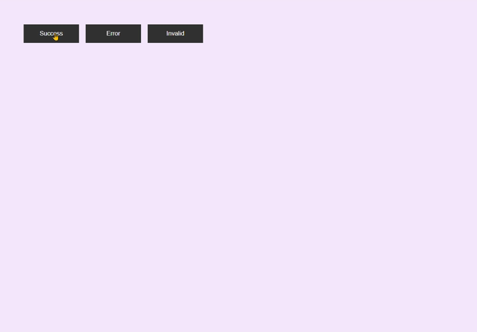

# Toast Notification 📢

## Overview
The *Toast Notification* is a lightweight web component that provides users with brief information updates in the form of toast messages. It is designed for simplicity and can be easily integrated into web applications. Toast messages can be triggered for various scenarios such as success, error, or invalid input.

## Technologies Used 🚀
- **HTML**
- **CSS (FlexBox)**
- **JavaScript**

## Usage 💻
1. **Trigger Toasts:**
   - Click on the provided buttons to trigger different types of toast messages (Success, Error, Invalid).
2. **Toast Appearance:**
   - Success: Green background with a checkmark icon.
   - Error: Red background with a cross icon.
   - Invalid: Yellow background with an exclamation icon.
3. **Duration:**
   - Toast messages will automatically disappear after 5 seconds.

## Live Demo 🌐
Live Demo : [Toast Notification Demo](https://toast-notification-snowy.vercel.app/)

## Installation
No special installation is required for this project. Simply download the project files and open the `index.html` file in a web browser.

## Contributing 🤝
Feel free to use, modify, and contribute to the project! If you have any questions or feedback, you can reach me at nisagokdemir@gmail.com

## License
This project is licensed under the **MIT License**.
